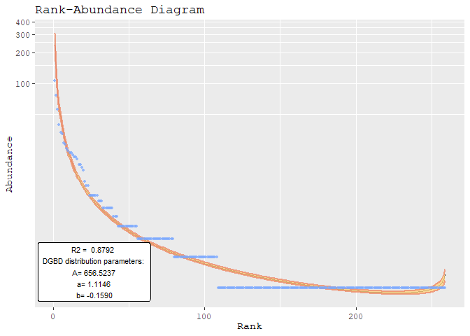
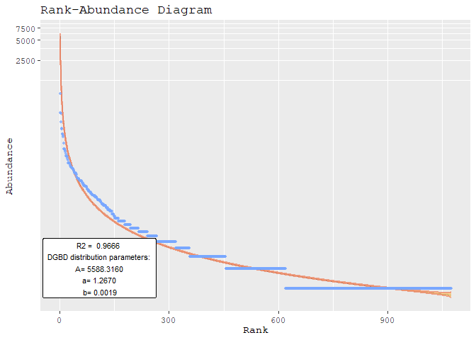
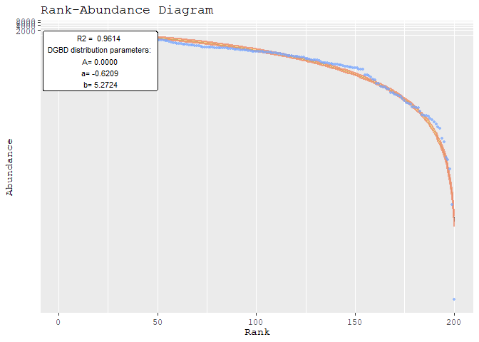

<!-- README.md is generated from README.Rmd. Please edit that file -->

# DGBD

<!-- badges: start -->
<!-- badges: end -->

## Citation

To cite this package:

Moedano-Vargas F, Alvarez-Martinez R (2024). *DGBD: Discrete Generalized
Beta Distribution Modeling and Plotting*. R package version 0.0.0.9004,
<https://github.com/Fa-Moe/DGBD>.

To obtain a BibTeX entry, you can run:

``` r
library(DGBD)
citation(package="DGBD")
```

## Description

Discrete Generalized Beta Distributions (DGBDs) provide a robust
alternative for modeling Rank-Abundance Distributions. Traditional
power-law distributions often offer accuracy within an intermediate
range but struggle to capture the logarithmic behavior at the
distribution’s tail ends. While additional parameters can sometimes
enhance power-law models, DGBDs inherently offer a superior fit for
these critical tail regions.

Beyond their applicability to Rank-Abundance Distributions, DGBDs are
effective in modeling ordering distributions across a wide array of
biological systems and disciplines. This versatility makes them an
invaluable tool for researchers in fields such as ecology, demography,
bibliometrics, and more. For an in-depth exploration of DGBDs, please
refer to Martínez-Mekler et al. (2009) at
<https://doi.org/10.1371/journal.pone.0004791>

DGBDs are characterized by three parameters: ‘A’, ‘a’, and ‘b’. This ‘R’
package facilitates fitting a DGBD to a given set of abundance data and
reporting these parameters. It utilizes ‘ggplot2’ for visualizing the
model.

## Installation

Install the development version of DGBD like so:

``` r
devtools::install_github("Fa-Moe/DGBD")
```

## Usage

Quickly analyze data frames and philoseq-class objects.

``` r
library(DGBD)
BC_report(Weblinks, column_report = 1, show_stats = F)
```



``` r
BC_report(Billionaires, column_report = 1, show_stats = F,model_extra="S")
```



``` r
BC_report(hmp_wgs, 2, show_stats = F,model_extra="R2",gfx_label_coords=c(50,1)) 
```



Generally the nls method is better at fitting the values on the left of
the graph, while performing worse on the right side of the graph.
BC_compare() can be used to compare both methods given a data set. The
goodness of fit tends to stay the same or get better when using the nls
method because the extremes are approximated better, however, most mid
and low values accumulate more error. This “spreading out” effect might
not be desirable, in which case the default method should be used.

``` r
BC_compare(Ecoli_deg, column_compare = 2,model_extra="S")[[1]]
```


