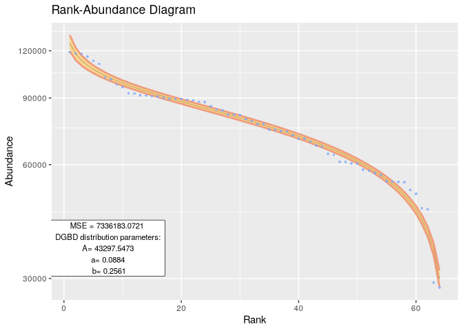
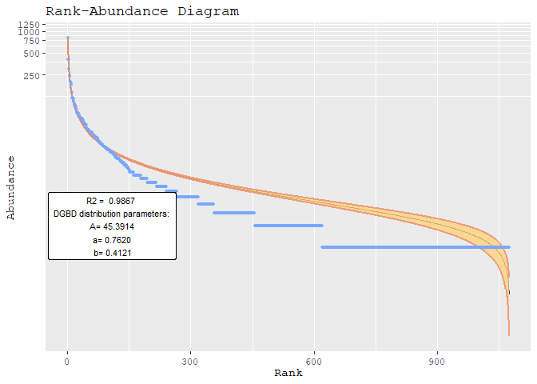
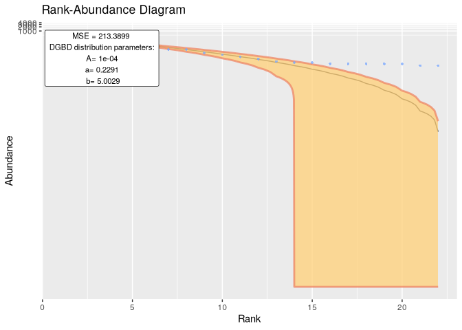
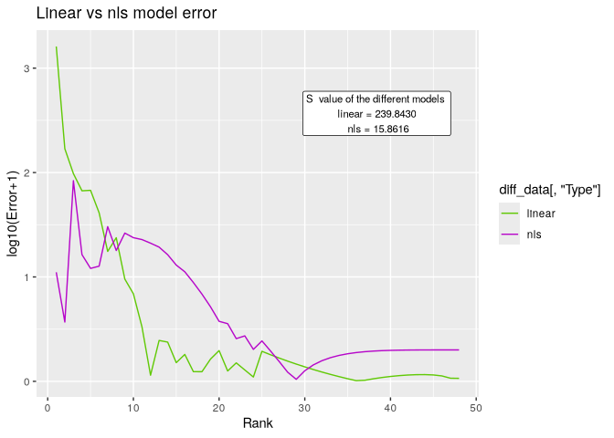
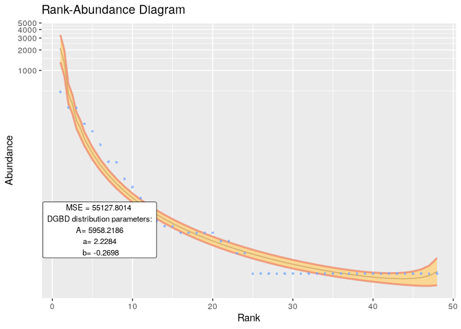

<!-- README.md is generated from README.Rmd. Please edit that file -->

# DGBD

<!-- badges: start -->
<!-- badges: end -->

## Citation

To cite this package:

Moedano-Vargas F, Alvarez-Martinez R (2024). *DGBD: Discrete Generalized
Beta Distribution Modeling and Plotting*. R package version 0.0.0.9006,
<https://github.com/Fa-Moe/DGBD>.

To obtain a BibTeX entry, you can run:

``` r
library(DGBD)
citation(package="DGBD")
```

## Description

Discrete Generalized Beta Distributions (DGBDs) provide a robust
alternative for modeling Rank-Abundance Distributions. Traditional
power-law distributions often offer accuracy within an intermediate
range but struggle to capture the logarithmic behavior at the
distribution’s tail ends. While additional parameters can sometimes
enhance power-law models, DGBDs inherently offer a superior fit for
these critical tail regions.


DGBDs are not only useful for Rank-Abundance Distributions but also excel in modeling ordered distributions across diverse biological systems and other disciplines. Their versatility makes them a valuable tool for researchers in fields such as ecology, demography, and bibliometrics. For a comprehensive exploration of DGBDs, see Martínez-Mekler et al. (2009) at <https://doi.org/10.1371/journal.pone.0004791> 

The flexibility of DGBDs allows their application in the analysis of various hierarchical structures, such as species abundance, city populations, or citation patterns in scientific literature. These distributions can provide insights into the underlying mechanisms and patterns of complex systems, offering a unified approach for understanding diverse phenomena across different fields. By employing DGBDs, researchers can uncover similarities and differences in the organization of seemingly unrelated systems, potentially leading to new hypotheses and interdisciplinary collaborations. 


The DGBDs are defined by three parameters: **A**, **a**, and **b**. This R package streamlines the process of fitting a DGBD model to a given set of abundance data, and provides estimates for these parameters. Additionally, it leverages ‘ggplot2’ to visualize the model results. The flexibility of DGBDs allows for the modeling of various types of rank-abundance relationships, from linear to highly curved distributions. This versatility makes them particularly useful in fields such as ecology, linguistics, and network science, in which complex hierarchical structures are common. Moreover, the package's integration with 'ggplot2' enables researchers to create publication-quality visualizations, facilitating the communication of results and patterns discovered through DGBD analysis. 

## Installation

Install the development version of DGBD like so:

``` r
devtools::install_github("Fa-Moe/DGBD")
```

## Usage

Quickly analyze data frames and phyloseq-class objects.

``` r
library(DGBD)

BC_report(df_abundance=DGBD::Billionaires, column = 2, show_stats = F, model_extra = "S")
```


## Using custom data

Data in .csv files can be easily provided for analysis. A similar method
can be used for .tsv files with `utils::read.table()`.

``` r
example_path <- system.file("extdata", "EC_Codon.csv", package = "DGBD") #This is just a string of text with the path of the .csv file
example_data <- read.csv(example_path,header=TRUE,row.names=1) #Your file might or might not have headers and row names.
BC_report(example_data, column = 1)
#> [1] "The data fit the DGB distribution with parameters:"
#>               A          a         b
#> 2.5 %  38795.90 0.10674700 0.2377527
#> 50 %   43297.55 0.08837031 0.2561294
#> 97.5 % 48321.54 0.06999362 0.2745061
#> [1] "And the fit has a MSE of:"
#> [1] 7336183
```



## Extra examples

``` r
BC_report(df_abundance=DGBD::Citation_ISICatalogued, column = 2, show_stats = F,rank_threshold=1)
```



``` r
BC_report(df_abundance=DGBD::hmp_wgs, 2, show_stats = F,model_extra="R2",gfx_label_coords=c(50,1)) 
```



``` r
BC_report(df_abundance=DGBD::Weblinks, column=2, rank_threshold=4, confidence_interval=0.99)
#> [1] "The data fit the DGB distribution with parameters:"
#>                A        a           b
#> 0.5 %  708982440 2.184956 -0.03184022
#> 50 %   735762921 2.182266 -0.02914983
#> 99.5 % 763554984 2.179575 -0.02645945
#> [1] "And the fit has a MSE of:"
#> [1] 4.24174e+13
```



``` r
BC_report(df_abundance=DGBD::MOMv3.3, column=7)
#> [1] "The data fit the DGB distribution with parameters:"
#>               A         a         b
#> 2.5 %  1.209095 0.2976284 0.3556487
#> 50 %   1.280005 0.2933839 0.3598932
#> 97.5 % 1.355073 0.2891393 0.3641378
#> [1] "And the fit has a MSE of:"
#> [1] 0.4211116
```




Generally, the nls method demonstrates superior performance in fitting values on the left side of the graph but exhibits diminished accuracy on the right side. The `BC_compare()`  function facilitates a comparison between the two methods for a given dataset. Although the goodness of fit often remains constant or improves with the nls method because of its enhanced approximation of extreme values, it introduces increased error in the mid and low ranges. This dispersion effect may be undesirable, in which case, the default method is preferable.

``` r
BC_compare(EC_Metabolite, column = 2,model_extra="S")[[1]]
```


