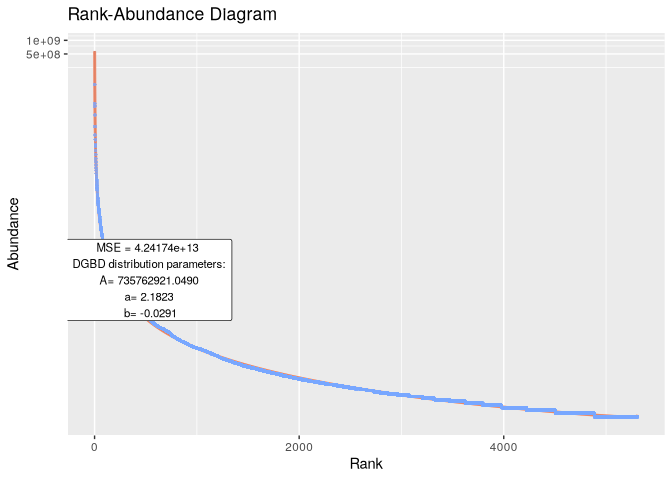
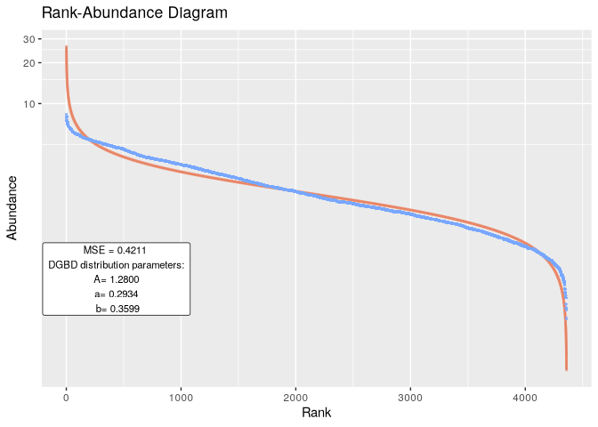

<!-- README.md is generated from README.Rmd. Please edit that file -->

# DGBD

<!-- badges: start -->
<!-- badges: end -->

Discrete Generalized Beta Distributions (DGBDs) are an alternative
option to model Rank-Abundance Distributions in ecology. Power-law
distributions are accurate for an intermediate range. Yet, they don’t
fit the tail ends where the behavior is logarithmic. While they can be
modified by additional parameters, DGBDs better model the tail regions
of the distribution.

DGBDs not only fit well to Rank-Abundance Distributions, but also to
ordering distributions in other biological systems and fields. Read
further in Martinez-Mekler et al. (2009)
<https://doi.org/10.1371/journal.pone.0004791>

DGBDs are described by 3 parameters: ‘A’, ‘a’ and ‘b’. This ‘R’ package
fits a DGBD to a given set of abundance data, reports these parameters
and uses ‘ggplot2’ to graph the model.

## Installation

Install the development version of DGBD like so:

``` r
devtools::install_github("Fa-Moe/DGBD")
```

## Usage

Quickly analyze philoseq-class objects and data frames.

``` r
library(DGBD)
Tara_Data
#> Loading required package: phyloseq
#> phyloseq-class experiment-level object
#> otu_table()   OTU Table:         [ 1701 taxa and 3 samples ]
#> sample_data() Sample Data:       [ 3 samples by 61 sample variables ]
#> tax_table()   Taxonomy Table:    [ 1701 taxa by 7 taxonomic ranks ]
Tara_DGBD <- BC_multiple(Tara_Data,is_phyloseq=TRUE,columns_select_multiple = c(1,2),plot_silent=T)
#> [1] "The data fit the DGB distribution with parameters:"
#>               A        a          b
#> 2.5 %  497.6530 1.147561 -0.1920345
#> 50 %   656.5237 1.114573 -0.1590458
#> 97.5 % 866.1122 1.081584 -0.1260571
#> [1] "And the fit has an R2 of:"
#> [1] 0.879234
```


    #> [1] "The data fit the DGB distribution with parameters:"
    #>               A        a            b
    #> 2.5 %  4327.562 1.288704 -0.024775637
    #> 50 %   5419.046 1.267957 -0.004028272
    #> 97.5 % 6785.821 1.247210  0.016719093
    #> [1] "And the fit has an R2 of:"
    #> [1] 0.6286568


``` r
Tara_DGBD <- BC_multiple(Tara_Data,is_phyloseq=TRUE,columns_select_multiple = c(3),plot_silent=T)
#> [1] "The data fit the DGB distribution with parameters:"
#>               A        a            b
#> 2.5 %  4555.386 1.285761 -0.016784526
#> 50 %   5588.316 1.267041  0.001935635
#> 97.5 % 6855.463 1.248321  0.020655796
#> [1] "And the fit has an R2 of:"
#> [1] 0.7930081
```


``` r
Tara_DGBD <- BC_multiple(Tara_Data,is_phyloseq=TRUE,columns_select_multiple = c(3),plot_silent=T,nls=TRUE) #Generally the nls method is better at fitting the values on the left of the graph, while performing worse on the right side of the graph. Yet, the R2 tends to stay the same or increase when using the nls method.
#> [1] "The data fit the DGB distribution with parameters:"
#>               A         a         b
#> 2.5 %  10.97475 0.7556983 0.3038271
#> 50 %   45.39142 0.7620199 0.4121401
#> 97.5 % 79.80809 0.7683415 0.5204532
#> [1] "And the fit has an R2 of:"
#> [1] 0.9867148
```



``` r
BC_report(hmp_wgs,2) 
#> [1] "The data fit the DGB distribution with parameters:"
#>                   A          a        b
#> 2.5 %  4.591541e-11 -0.4345076 5.086016
#> 50 %   2.018236e-10 -0.6208510 5.272359
#> 97.5 % 8.871265e-10 -0.8071944 5.458703
#> [1] "And the fit has an R2 of:"
#> [1] 0.8341139
```


